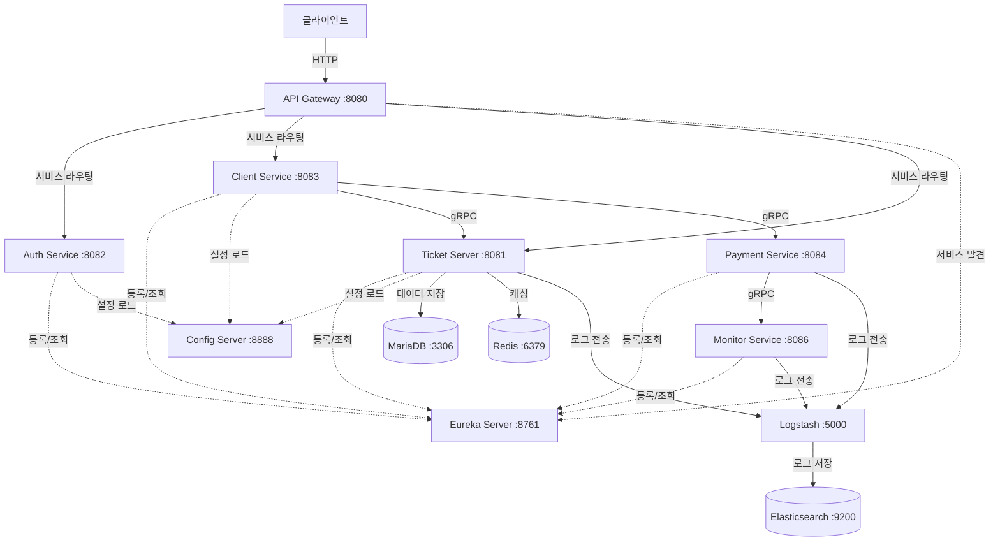

# 🎫 Ticket Reservation System

Spring Cloud 기반 마이크로서비스 아키텍처를 활용한 분산 티켓 예약 시스템

## 📋 목차

- [프로젝트 개요](#-프로젝트-개요)
- [시스템 아키텍처](#-시스템-아키텍처)
- [기술 스택](#-기술-스택)
- [서비스 구성](#-서비스-구성)
- [주요 기능](#-주요-기능)
- [인프라 구성](#-인프라-구성)
- [실행 방법](#-실행-방법)
- [API 엔드포인트](#-api-엔드포인트)

---

## 🎯 프로젝트 개요

본 프로젝트는 **마이크로서비스 아키텍처(MSA)** 기반으로 구축된 대규모 트래픽 대응형 티켓 예약 시스템입니다. Spring Cloud를 활용하여 서비스 디스커버리, 중앙 설정 관리, API 게이트웨이 등의 분산 시스템 패턴을 구현했습니다.

### 핵심 특징

- ✅ **마이크로서비스 아키텍처**: 독립적으로 배포 가능한 7개의 서비스
- ✅ **gRPC 통신**: 고성능 서비스 간 통신
- ✅ **Spring Cloud 통합**: Eureka, Config Server, Gateway
- ✅ **분산 로깅**: ELK Stack (Elasticsearch, Logstash, Kibana)
- ✅ **실시간 모니터링**: 중앙 집중식 로그 수집 및 분석
- ✅ **컨테이너화**: Docker Compose 기반 배포

---

## 🏗️ 시스템 아키텍처

### 전체 아키텍처



### 통신 프로토콜

| 통신 유형 | 프로토콜 | 용도 |
|----------|---------|------|
| 클라이언트 ↔ Gateway | HTTP/REST | 외부 API 요청 |
| 서비스 간 비즈니스 로직 | gRPC | 고성능 내부 통신 |
| 서비스 ↔ Eureka | HTTP/REST | 서비스 등록/발견 |
| 서비스 ↔ Config Server | HTTP/REST | 설정 조회 |
| 서비스 → Logstash | TCP | 로그 스트리밍 |

---

## 🛠️ 기술 스택

### 백엔드 프레임워크
- **Spring Boot 3.3.5**: 최신 Java 21 지원
- **Spring Cloud 2023.0.3**: 분산 시스템 패턴
  - Spring Cloud Netflix Eureka: 서비스 디스커버리
  - Spring Cloud Config: 중앙 설정 관리
  - Spring Cloud Gateway: API 게이트웨이

### 통신 & 프로토콜
- **gRPC 1.62.2**: 서비스 간 고성능 통신
- **Protocol Buffers**: IDL (Interface Definition Language)
- **Spring Boot Actuator**: 헬스체크 & 메트릭

### 데이터베이스 & 캐싱
- **MariaDB 10.11**: 관계형 데이터베이스
- **Redis (latest)**: 인메모리 캐시
- **Redisson 3.40.0**: Redis 클라이언트 (분산 락 지원)
- **Spring Data JPA**: ORM
- **QueryDSL**: 타입 안전 쿼리

### 보안 & 인증
- **Spring Security**: 인증/인가
- **OAuth2 Client**: 소셜 로그인 (Google, Kakao)
- **JWT (jjwt 0.12.6)**: 토큰 기반 인증

### 로깅 & 모니터링
- **Elasticsearch 7.17.10**: 로그 저장 및 검색
- **Logstash 7.17.10**: 로그 수집 및 변환
- **Logstash Logback Encoder 8.0**: 구조화된 로그
- **gRPC-based Log Aggregation**: 커스텀 로그 수집

### 인프라 & 배포
- **Docker & Docker Compose**: 컨테이너화
- **Gradle 8.x**: 빌드 도구
- **Java 21**: LTS 버전 (Virtual Threads 지원)

### 프론트엔드
- **Thymeleaf**: 서버 사이드 템플릿 엔진

---

## 📦 서비스 구성

### 1️⃣ Infrastructure Services (Spring Cloud)

#### Eureka Server (`:8761`)
**역할**: 서비스 레지스트리 및 디스커버리
- 모든 마이크로서비스가 자동 등록
- 서비스 간 동적 서비스 위치 검색
- 헬스체크 및 자동 장애 격리

#### Config Server (`:8888`)
**역할**: 중앙 집중식 설정 관리
- 모든 서비스의 설정 파일 관리
- 환경별 설정 분리 (dev, staging, prod)
- 동적 설정 갱신 지원

#### API Gateway (`:8080`)
**역할**: 단일 진입점 및 라우팅
- 클라이언트 요청의 단일 엔드포인트
- 서비스별 동적 라우팅
- CORS 처리
- 로드 밸런싱

### 2️⃣ Business Services

#### Auth Service (`:8082`)
**역할**: 인증 및 인가
- OAuth2 소셜 로그인 (Google, Kakao)
- JWT 토큰 발급 및 검증
- 사용자 세션 관리

**주요 기술**:
- Spring Security
- OAuth2 Client
- JWT

#### Client Service (`:8083`)
**역할**: 웹 프론트엔드 제공
- 사용자 UI 제공 (Thymeleaf)
- Ticket Server 및 Payment Service와 gRPC 통신
- 티켓 조회, 예약 요청 처리

**통신**:
- gRPC → Ticket Server (티켓 조회/예약)
- gRPC → Payment Service (결제 요청)

#### Ticket Server (`:8081`, gRPC `:9090`)
**역할**: 핵심 비즈니스 로직
- 콘서트 정보 관리
- 좌석 예약 처리
- 대기열 관리
- 재고 관리 (Redis 캐싱)
- 데이터베이스 트랜잭션 처리

**주요 기술**:
- Spring Data JPA
- QueryDSL
- Redis (Redisson)
- MariaDB
- gRPC Server

**데이터 모델**:
- Concert (콘서트)
- ConcertOption (회차)
- Seat (좌석)
- Reservation (예약)
- User (사용자)
- Queue (대기열)

#### Payment Service (`:8084`, gRPC `:9091`)
**역할**: 결제 처리
- 결제 요청 처리
- 결제 내역 관리
- Monitor Service로 결제 로그 전송 (gRPC)

**통신**:
- gRPC Server: 결제 요청 수신
- gRPC Client → Monitor Service: 로그 전송

#### Monitor Service (`:8086`, gRPC `:9095`)
**역할**: 로그 수집 및 모니터링
- 다른 서비스로부터 gRPC로 로그 수신
- Elasticsearch에 로그 저장
- 로그 조회 API 제공

**주요 기술**:
- gRPC Server
- Elasticsearch Client

### 3️⃣ Shared Library

#### Proto Module
**역할**: gRPC 프로토콜 정의 및 공유
- `.proto` 파일로 서비스 인터페이스 정의
- 모든 서비스에서 공통으로 사용하는 라이브러리
- Protobuf 컴파일을 통한 Java 클래스 생성

---

## 🎯 주요 기능

### 1. 서비스 디스커버리 (Eureka)
- **동적 서비스 등록**: 서비스 시작 시 자동으로 Eureka에 등록
- **헬스체크**: `/actuator/health` 엔드포인트를 통한 상태 모니터링
- **자동 장애 격리**: 비정상 서비스 자동 제거
- **클라이언트 사이드 로드밸런싱**: 서비스 인스턴스 간 부하 분산

### 2. gRPC 서비스 디스커버리
- **Eureka 통합**: `discovery:///service-name` 형식으로 동적 서비스 검색
- **메타데이터 활용**: Eureka 인스턴스 메타데이터에 gRPC 포트 저장
```yaml
eureka:
  instance:
    metadata-map:
      gRPC.port: ${grpc.server.port}
```

### 3. 분산 로깅
- **다층 로그 수집**:
  1. Logstash Appender를 통한 직접 전송
  2. gRPC를 통한 커스텀 로그 수집
- **중앙화된 로그 저장**: Elasticsearch
- **로그 조회 API**: Monitor Service 제공

### 4. 대기열 시스템
- **대규모 트래픽 처리**: Redis 기반 대기열
- **순차적 티켓 발급**: 공정한 선착순 처리

### 5. 캐싱 전략
- **Redis 분산 캐시**: 좌석 재고 정보 캐싱
- **성능 최적화**: DB 쿼리 부하 감소

---

## 🏢 인프라 구성

### Docker Compose 서비스

| 서비스 | 이미지 | 포트 | 역할 |
|--------|--------|------|------|
| eureka-server | eclipse-temurin:21-jdk-alpine | 8761 | 서비스 레지스트리 |
| config-server | eclipse-temurin:21-jdk-alpine | 8888 | 설정 서버 |
| gateway | eclipse-temurin:21-jdk-alpine | 8080 | API 게이트웨이 |
| auth-service | eclipse-temurin:21-jdk | 8082 | 인증 서비스 |
| client-service | eclipse-temurin:21-jdk | 8083 | 클라이언트 서비스 |
| ticket-server | eclipse-temurin:21-jdk | 8081, 9090 | 티켓 서버 |
| payment-service | eclipse-temurin:21-jdk | 8084, 9091 | 결제 서비스 |
| monitor-service | eclipse-temurin:21-jdk | 8086, 9095 | 모니터링 서비스 |
| mariadb | mariadb:10.11 | 3306 | 데이터베이스 |
| redis | redis:latest | 6379 | 캐시 |
| elasticsearch | elasticsearch:7.17.10 | 9200 | 로그 저장 |
| logstash | logstash:7.17.10 | 5000 | 로그 수집 |

### 의존성 그래프

```
mariadb, redis, elasticsearch ─┐
                                ▼
                          eureka-server
                                │
                ┌───────────────┼───────────────┐
                ▼               ▼               ▼
          config-server   ticket-server   monitor-service
                │               │               │
                ▼               └───────┬───────┘
             gateway                    ▼
                │                 payment-service
                └───────┬────────────────┘
                        ▼
              auth-service, client-service
```

---

## 🚀 실행 방법

### 사전 요구사항
- **Java 21** 이상
- **Docker & Docker Compose**
- **Gradle 8.x**

### 1단계: 프로젝트 빌드

```bash
# 전체 프로젝트 빌드 (테스트 제외)
./gradlew clean build -x test
```

### 2단계: Docker Compose로 실행

```bash
# 모든 서비스 시작
docker-compose up -d

# 로그 확인
docker-compose logs -f

# 서비스 상태 확인
docker-compose ps
```

### 3단계: 서비스 확인

| 서비스 | URL | 설명 |
|--------|-----|------|
| Eureka Dashboard | http://localhost:8761 | 등록된 서비스 확인 |
| API Gateway | http://localhost:8080 | 모든 API 접근 |
| Client Web | http://localhost:8083 | 사용자 웹 인터페이스 |
| Auth Service | http://localhost:8082 | 인증 서비스 |
| Ticket Server | http://localhost:8081 | 티켓 API |
| Elasticsearch | http://localhost:9200 | 로그 조회 (직접) |

### 4단계: 서비스 중지

```bash
# 모든 서비스 중지 및 삭제
docker-compose down

# 볼륨까지 삭제
docker-compose down -v
```

---

## 📡 API 엔드포인트

### API Gateway를 통한 접근
모든 API는 게이트웨이 `http://localhost:8080`를 통해 접근합니다.

#### 인증 (Auth Service)
```http
# OAuth2 로그인 페이지
GET /login

# Google OAuth2
GET /oauth2/authorization/google

# Kakao OAuth2
GET /oauth2/authorization/kakao
```

#### 티켓 조회 및 예약 (Client Service)
```http
# 콘서트 목록 조회
GET /client/concerts

# 좌석 조회
GET /client/concerts/{concertId}/seats

# 티켓 예약
POST /client/reservations
```

#### 결제 (Payment Service)
```http
# 결제 요청
POST /payment/process

# 결제 내역 조회
GET /payment/history
```

#### 모니터링 (Monitor Service)
```http
# 로그 조회
GET /monitor/logs

# 시스템 상태
GET /actuator/health
```

---

## 📊 모니터링 및 운영

### 헬스체크
모든 서비스는 Spring Boot Actuator를 통해 헬스체크 엔드포인트를 제공합니다:
```bash
curl http://localhost:8081/actuator/health
```

### Eureka 대시보드
서비스 등록 상태를 시각적으로 확인:
```
http://localhost:8761
```

예상 등록 서비스:
- TICKET-SERVER
- AUTH-SERVICE
- CLIENT-SERVICE
- PAYMENT-SERVICE
- MONITOR-SERVICE
- CONFIG-SERVER
- GATEWAY

### 로그 확인

#### Docker 로그
```bash
# 특정 서비스 로그
docker logs ticket-server -f

# 모든 서비스 로그
docker-compose logs -f
```

#### Elasticsearch 로그 조회
```bash
# 최근 로그 조회
curl http://localhost:9200/logs-*/_search?pretty
```

---

## 🔧 개발 가이드

### 새로운 서비스 추가

1. **Gradle 모듈 생성**
```groovy
// settings.gradle
include 'new-service'
```

2. **build.gradle 설정**
```groovy
dependencies {
    implementation project(':proto')
    implementation 'org.springframework.boot:spring-boot-starter-web'
    implementation 'org.springframework.cloud:spring-cloud-starter-netflix-eureka-client'
}
```

3. **application.yml 작성**
```yaml
spring:
  application:
    name: new-service

eureka:
  client:
    service-url:
      defaultZone: http://eureka-server:8761/eureka/
```

4. **Dockerfile 작성**
```dockerfile
FROM eclipse-temurin:21-jdk
WORKDIR /app
COPY build/libs/*.jar app.jar
EXPOSE 8080
ENTRYPOINT ["java", "-jar", "app.jar"]
```

5. **docker-compose.yaml 추가**
```yaml
new-service:
  build: ./new-service
  container_name: new-service
  ports:
    - "8085:8085"
  environment:
    - EUREKA_CLIENT_SERVICE_URL_DEFAULTZONE=http://eureka-server:8761/eureka/
  depends_on:
    eureka-server:
      condition: service_healthy
  networks:
    - ticket-network
```

### gRPC 서비스 정의

1. **.proto 파일 작성** (`proto/src/main/proto/`)
```protobuf
syntax = "proto3";

service NewService {
  rpc DoSomething(Request) returns (Response);
}

message Request {
  string data = 1;
}

message Response {
  string result = 1;
}
```

2. **빌드하여 Java 클래스 생성**
```bash
./gradlew :proto:build
```

3. **gRPC 서버 구현**
```java
@GrpcService
public class NewServiceImpl extends NewServiceGrpc.NewServiceImplBase {
    @Override
    public void doSomething(Request request, StreamObserver<Response> responseObserver) {
        Response response = Response.newBuilder()
            .setResult("processed: " + request.getData())
            .build();
        responseObserver.onNext(response);
        responseObserver.onCompleted();
    }
}
```

---

## ⚠️ 트러블슈팅

### Issue 1: 서비스가 "PROTO"로 등록됨

**증상**: Eureka에 모든 서비스가 "PROTO"라는 이름으로 등록

**원인**: `proto` 모듈에 `application.properties`가 있으면 안 됨

**해결**:
```bash
# proto 모듈의 application.properties 삭제
rm proto/src/main/resources/application.properties

# 재빌드 및 재배포
./gradlew clean build -x test
docker-compose down && docker-compose up -d --build
```

### Issue 2: Logstash 연결 실패

**증상**: `Connection refused` 에러

**원인**: 환경 변수 `LOGSTASH_HOST`가 설정되지 않음

**해결**: `compose.yaml`에 환경 변수 추가
```yaml
environment:
  - LOGSTASH_HOST=logstash
```

### Issue 3: Redis 인증 에러

**증상**: `NOAUTH Authentication required`

**해결**: 개발 환경에서는 Redis 비밀번호 제거
```yaml
# compose.yaml
redis:
  image: redis:latest
  # command 제거
```

---

## 📈 성능 최적화

### Virtual Threads (Java 21)
```yaml
spring:
  threads:
    virtual:
      enabled: true
```
높은 동시성 처리를 위한 가상 스레드 활성화

### Redis 캐싱
- 좌석 재고 정보 캐싱으로 DB 부하 감소
- Redisson의 분산 락으로 동시성 제어

### gRPC 사용
- HTTP/REST 대비 낮은 레이턴시
- Protocol Buffers로 작은 메시지 크기

---

## 🔐 보안 고려사항

- **OAuth2 소셜 로그인**: 사용자 비밀번호를 직접 관리하지 않음
- **JWT 토큰**: Stateless 인증
- **환경 변수**: 민감한 정보 (DB 비밀번호 등)는 환경 변수로 관리
- **HTTPS**: 프로덕션 환경에서 필수 (현재 개발 환경은 HTTP)

---

## 📝 향후 개선 사항

### 1. Circuit Breaker
- **Resilience4j** 추가하여 장애 전파 방지
- Fallback 메커니즘 구현

### 2. Distributed Tracing
- **Spring Cloud Sleuth + Zipkin** 도입
- 요청 추적 및 성능 분석

### 3. Config Server Git 통합
- 설정 파일을 Git 저장소로 관리
- 버전 관리 및 롤백 지원

### 4. API Rate Limiting
- API Gateway에서 요청 제한
- 서비스 과부하 방지

### 5. Database Replication
- Master-Slave 구성
- 읽기 성능 향상

---

## 👥 기여 가이드

### 브랜치 전략
- `main`: 프로덕션 배포
- `develop`: 개발 통합
- `feature/*`: 새로운 기능
- `hotfix/*`: 긴급 수정

### 커밋 메시지 컨벤션
```
feat: 새로운 기능 추가
fix: 버그 수정
docs: 문서 수정
refactor: 코드 리팩토링
test: 테스트 코드 추가
chore: 빌드 설정 변경
```

---

## 연락처

010-4657-4077

---

**Last Updated**: 2026-01-29
**Version**: 1.0.0
